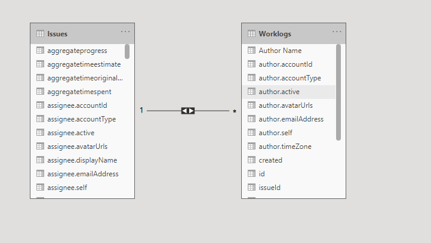

# jira-powerbi-template
A Power BI template to connect with Jira and create custom reports

Jira is one of the most used tool for task/project management, but if you are a Project Manager or Executive who's team is using Jira, your biggest frustration must be that you can't summarize the data and extract meaningful information out of it, the reporting tool provided by Jira is pretty much unusable. Although, there are alot of plugins available in Jira marketplace which offer reporting capabilities but all of them are paid. You can also create Jira plugins yourselves but not everyone has a developer to get some very basic reports created.

# How To Use

## Generate API Token from Atlassian

1. Login to your atlassian account.
2. Go to Account Setting page and then navigate to Security.
3. Under API Token, click on 'Create and manage API tokens'.
4. Create a new API Token and give it any name of your choice. Copy the API Token somewhere safe. 

## For Power BI Desktop

1. Download the template file to your computer.
2. Open the file in Power BI Desktop by double clicking on the template file.
3. A popup will appear asking for the URL and Project
4. Type in the URL for your JIRA Cloud, for e.g. https://yourcompanyname.atlassian.net.
5. Type in the Project initials if you want to fetch issues for one project only. Put a asterik * in Project parameter if you wish to fetch all projects.
6. Click Load, after some processing, a popup will appear asking for credentials. Choose Basic authentication and type in your email address as Username and the API token as your password.
7. Hit enter and it will start to load all the data from your Jira account to your report.

# Report's Dataset

Two tables will be created as part of this report,

### 1. Issues
This table has all the columns that Jira has for an issue.

### 2. Worklogs
This table has all the Worklogs logged by the users against any issue. This table has one-to-many relationship with the Issues table.

**Note: The dataset is not realtime, so everytime you are generating a report, you will have to manually refresh the data**

# Sample Out-of-the-box Reports

The sample reports which already part of the template are the most common problem I personally faced every week/month related to logged hours by members.  

# Idea Credit

The basic idea of this project was taken from [Power BI Content Pack](https://powerbi.microsoft.com/en-us/blog/explore-your-jira-data-with-power-bi/) which was available in Power BI Apps, but was then removed. This template uses a modified version of the code from that content pack. 
Updates include,
* Version update of the API used
* Addition of Worklogs table
* Inclusion of all the fields available for an issue.
